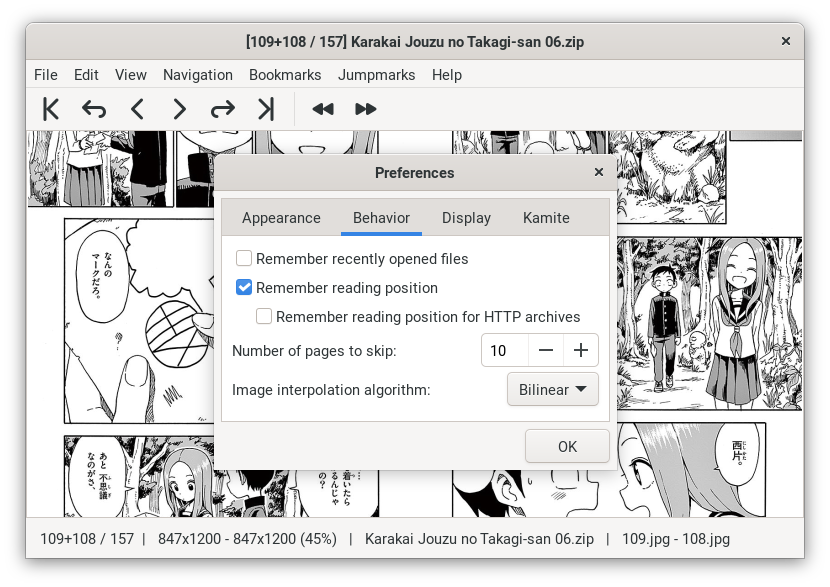

<!-- vim: set textwidth=80 colorcolumn=80: -->
<!-- markdownlint-configure-file
{
  "no-inline-html": false
}
-->
# Gomics-v

> A GTK comic viewer

Gomics-v is a GTK comic and image archive viewer written in Go, available under
the GNU GPL v3 or later.

**This is a personal fork of *Gomics* (without the *-v*). Please also consult the
main project’s README at <https://github.com/salviati/gomics>**.

This fork has been made with personal use for reading manga with
mouse-centered navigation in mind. Consequently, some aspects of other workflows
might have been broken.

The program has only been confirmed to work on Linux, but it is possible it
would work on other platforms.

<p align="center">
  
</p>

## Changes from Gomics

* Added **Jumpmarks**

  Temporary page marks for quickly jumping around the currently open archive.
  See the `Jumpmarks` menu in the menu bar for more information.

* Added **Hide UI** option (`Alt+M` to hide/unhide).

* Added *experimental* **HTTP archive support**

  See `File › Open URL (experimental)` for a detailed explanation.
  A HTTP archive can alternatively be loaded by providing the URL as a program
  argument (see `./gomicsv --help`) or by pasting the URL into the program.

* **Reworked page navigation**

  * Click the left/right half of the image area to go to the previous/next page.

  * Drag with the middle mouse button to pan around the image.

* Added integration with **[Kamite]** (a desktop Japanese immersion companion)

  Right-click on text block for automatic OCR. Right-hold-click to initialize
  manual block recognition selection. *Must be first enabled in Preferences.*

* Added **Remember reading position** option

  Automatically saves the last reading position for each archive and resumes
  reading at that position. *Must be first enabled in Preferences.*

* Added **Save image as…** command

* Added **Copy image to clipboard** command

* Polished the look of preferences UI.

* Made the Background color preference functional.

* Reorganized the codebase.

* Various other minor tweaks (and breakages).

[Kamite]: https://github.com/fauu/Kamite

## Installation

Download the latest release package from the [Releases] page (Linux only) and
extract it to the location where you want to keep the program files (e.g.,
`/opt/gomicsv`).

Or build it from the source (see below).

[Releases]: https://github.com/fauu/gomicsv/releases

## Known issues

* On GNOME, *Hide UI* breaks once the window is made full screen or maximized.

## Building

```sh
git clone "https://github.com/fauu/gomicsv"
cd gomicsv
make build
```

A self-contained Gomics-v executable will be produced at `target/gomicsv`.

Building requires [go] and some GTK-related dependencies. See
[gomics: Requirements][gomics-requirements]. GTK-related build steps might take
up to 15 minutes on first compile.

---

Extra information for Windows and macOS:

- <https://github.com/gotk3/gotk3/wiki/Installing-on-Windows>

- <https://github.com/gotk3/gotk3/wiki/Installing-on-macOS>

[go]: https://go.dev/
[gomics-requirements]: https://github.com/salviati/gomics#requirements

## License

Gomics-v\
Copyright (c) 2013–2021 Utkan Güngördü <utkan@freeconsole.org>\
Copyright (c) 2021–2023 Piotr Grabowski

This program is free software: you can redistribute it and/or modify it under
the terms of the GNU General Public License as published by the Free Software
Foundation, either version 3 of the License, or (at your option) any later
version.

This program is distributed in the hope that it will be useful, but WITHOUT ANY
WARRANTY; without even the implied warranty of MERCHANTABILITY or FITNESS FOR A
PARTICULAR PURPOSE. See the GNU General Public License for more details.

You should have received a copy of the GNU General Public License along with
this program. If not, see <https://www.gnu.org/licenses/>.
